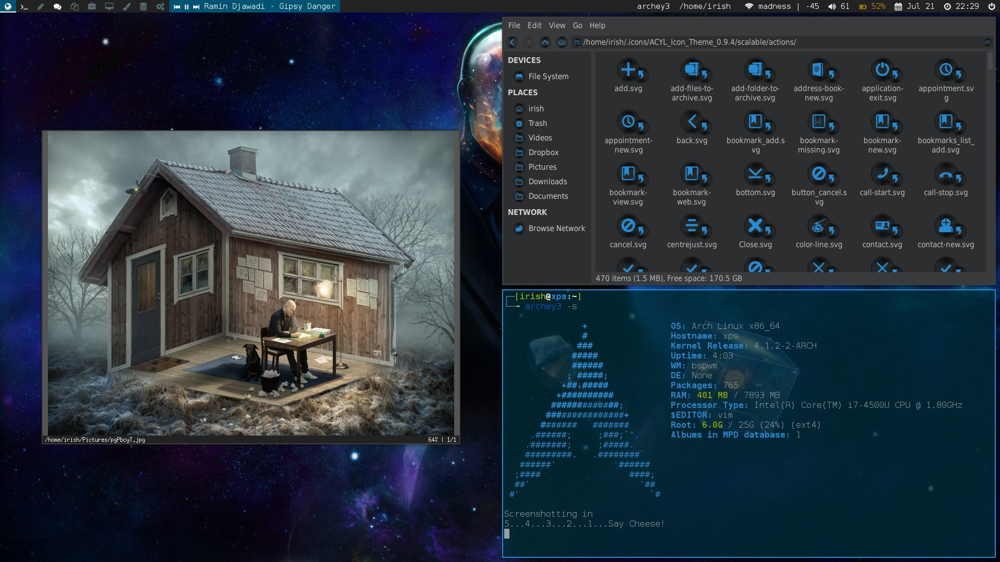

# dotfiles

Myriad configuration files for frequently used applications.

# Installation

## Requirements

### GNU Stow

The files are packaged for installation with [GNU stow][stow]
([documentation][stow-doc]). Each package can be installed individually, or
`install.sh` can be used to install all packages at once.

#### Caveats

If `stow` tries to install a file that already exists, it will fail. Remove or
backup any existing files before installing.

### Fonts

The desktop names and status indicators used on the panel are unicode
characters from some special icon fonts. Install them according to your
distribution's instructions.

- [Font Awesome][font-awesome]
- [Foundation Icon Fonts][foundation-icon-font]

## Environment Variables

The following environment variables are used in some `sxhkd` bindings and
scripts. They should be set in `.profile` or similar to ensure all bindings
work correctly. This makes it easier to specify the applications the user
wishes to use without putting those preferences in version control.

- `BROWSER` - Web browser: `chromium`, `google-chrome`, `firefox`, etc.
- `EDITOR` - Terminal based text editor: `vim`, `vim`, `emacs`, or `vim`.
- `VISUAL` - GUI text editor: `gvim`, `gvim -f`, `xemacs`, etc.
- `FILE_BROWSER` - File explorer: `thunar`, `nautilus`, `pcmanfm`, etc.
- `SXHKD_SHELL` - A shell through which to run `sxhkd` bindings. My bindings are
  currently compatibile with `bash`.
- `TERMINAL` - Terminal emulator: `urxvtc`, `urxvt256c-mlc`, `termite`, `terminator`, etc.

# Packages

- `bash` - `.bashrc` and aliases.
- `bin` - Scripts for [lemonbar][lemonbar] and application launchers.
- `bspwm` - Configuration files for the binary space partitioning window
  manager, [bspwm][bspwm].
- `dunst` - Configuration files for the [dunst][dunst] notification daemon.
- `fish` - Configuration files and custom functions for the [fish][fish] shell.
- `ssh` - Configuration files for `ssh`.
- `sxhkd` - Configuration for the simple X hotkey daemon, [sxhkd][sxhkd].
- `Templates` - Skeleton files for several programming languages.
- `vim` - `.vimrc`.
- `Xresources` - Terminal options and colorschemes.

# Screenshot

# Troubleshooting

## Scripts Not Executing

Depending on how the `$PATH` is setup for your session, it may not include
`~/.local/bin/`. This will cause the [bspwm][bspwm] scripts to fail to load (as
they won't be found).

Manually create symlinks to these files in a location that will be in your
`$PATH` when your session launches, such as `/usr/local/bin/`, or ensure
`~/.local/bin/` is added to the global `$PATH`.

`# ln -s ~/.local/bin/panel /usr/local/bin/panel`, etc.

[bspwm]: https://github.com/baskerville/bspwm "Binary Space Partitioning Window Manager"
[dunst]: https://github.com/knopwob/dunst "dunst Notification Daemon"
[fish]: http://fishshell.com "Fish Shell"
[font-awesome]: http://fortawesome.github.io/Font-Awesome "Font Awesome"
[foundation-icon-font]: http://zurb.com/playground/foundation-icon-fonts-3 "Foundation Icon Fonts"
[lemonbar]: https://github.com/LemonBoy/bar "LemonBoy's bar"
[stow]: https://www.gnu.org/software/stow "GNU Stow"
[stow-doc]: http://www.gnu.org/software/stow/manual/stow.html "GNU Stow Documentation"
[sxhkd]: https://github.com/baskerville/sxhkd "Simple X HotKey Daemon"
[vim]: https://github.com/vim/vim "Vi Improved"
